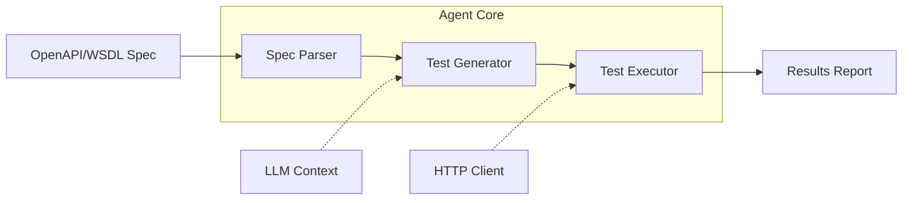

# agent-api-validator

[](https://github.com/Jai-Gogineni/agent-api-validator/actions/workflows/ci.yml)
[](https://opensource.org/licenses/MIT)
[](https://www.typescriptlang.org/)
[](https://modelcontextprotocol.io)

> Autonomous API validation agent — reads your spec, generates tests, executes them

## Architecture



## Quick Start

```bash
# Clone the repository
git clone https://github.com/Jai-Gogineni/agent-api-validator.git
cd agent-api-validator

# Install dependencies
npm install

# Build
npm run build
```

## Project Structure

```
src/
├── agent.ts            # MCP server entry point
├── spec-parser.ts      # OpenAPI 3.0 specification parser
├── test-generator.ts   # LLM-prompted test case generation
└── executor.ts         # HTTP test execution engine
```

## How It Works

1. **Parse** — Reads OpenAPI 3.0 (JSON/YAML) specifications and extracts endpoint definitions
2. **Generate** — Creates comprehensive test cases including happy paths, error scenarios, and edge cases
3. **Execute** — Runs generated tests against the target API with configurable concurrency
4. **Report** — Returns structured pass/fail results with response times and assertion details

## MCP Tools

| Tool | Description |
|------|-------------|
| `validate_api` | Full validation pipeline: parse → generate → execute → report |
| `parse_spec` | Parse an OpenAPI spec and return endpoint summary |

## License

MIT © 2024 Jai Gogineni
