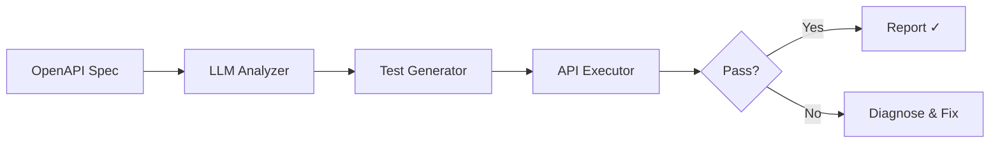

# agent-api-validator

[](https://github.com/Jai-Gogineni/agent-api-validator/actions)
[](LICENSE)
[](https://www.typescriptlang.org/)

AI agent that autonomously validates REST and SOAP APIs. Reads OpenAPI/WSDL specs, generates comprehensive test cases using LLM reasoning, executes them, and reports failures with suggested fixes.

## How It Works



## Quick Start

```bash
git clone https://github.com/Jai-Gogineni/agent-api-validator.git
cd agent-api-validator
npm install
cp .env.example .env  # Add your API keys
npm run build
```

## Configuration

| Variable | Required | Description |
|----------|----------|-------------|
| `ANTHROPIC_API_KEY` | Yes | Anthropic API key for test generation |
| `TARGET_API_URL` | Yes | Base URL of the API to validate |

## Example Usage

```typescript
import { APIValidatorAgent } from "./src/agent";

const agent = new APIValidatorAgent(process.env.ANTHROPIC_API_KEY!);
const tests = await agent.generateTests("https://api.example.com/openapi.json");
const results = await agent.validateEndpoint("/users", "GET", 200);
console.log(results);
```

## Architecture

Built with TypeScript for type safety, uses the Anthropic SDK for LLM capabilities, and follows a single-responsibility pattern where each agent has one clear job. Designed to be composable — agents can be chained together for complex workflows.

## Contributing

See [CONTRIBUTING.md](CONTRIBUTING.md) for guidelines.

## Author

**Jai Gogineni** — [jaigogineni.com](https://jaigogineni.com) · [LinkedIn](https://uk.linkedin.com/in/jai-gogineni-9a396654)
